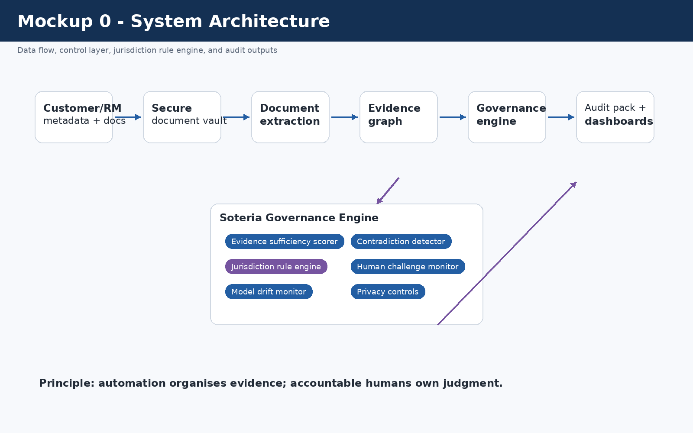
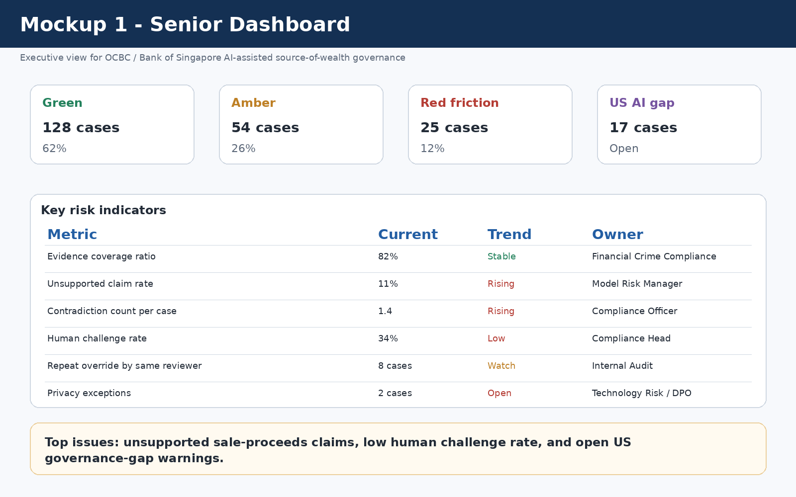
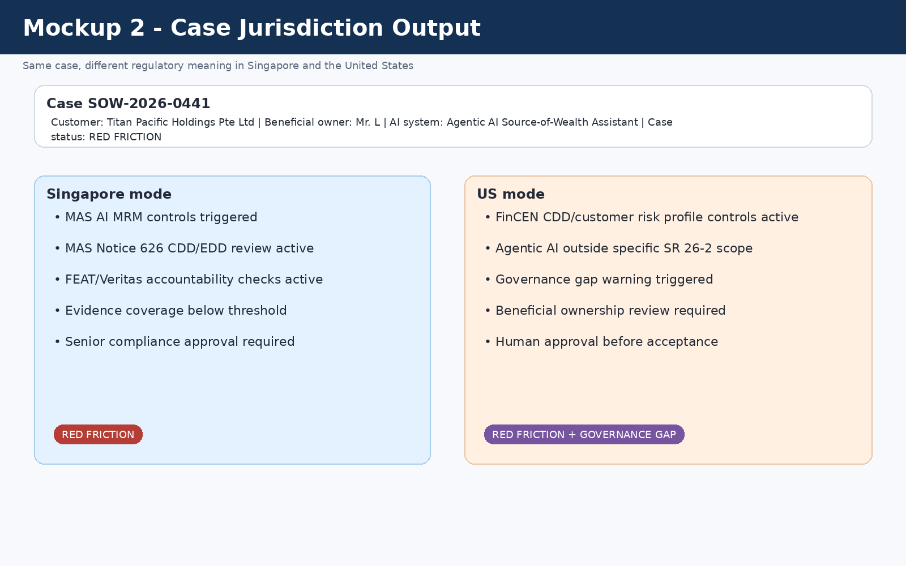
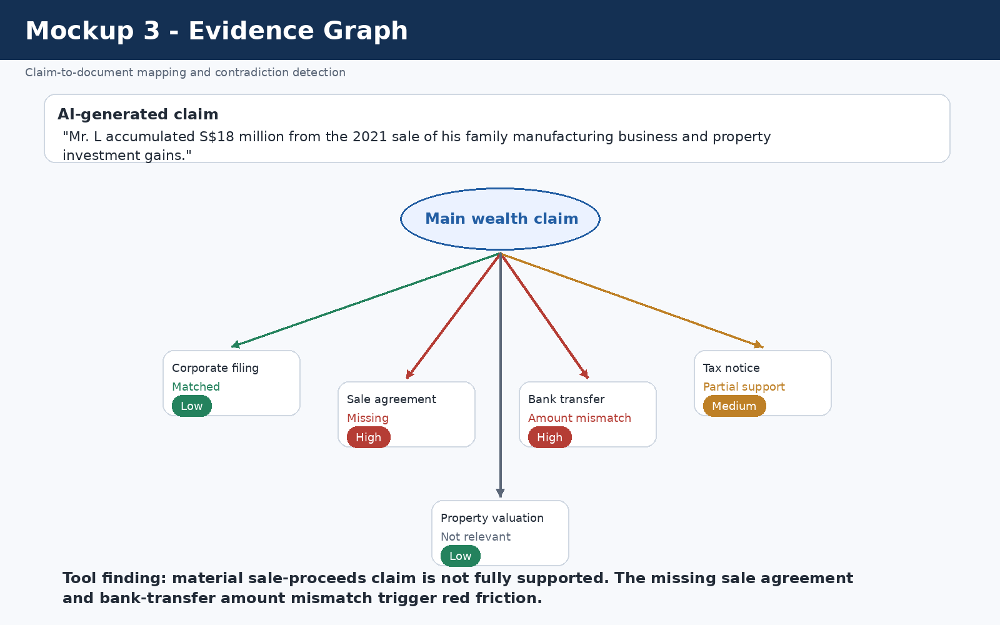
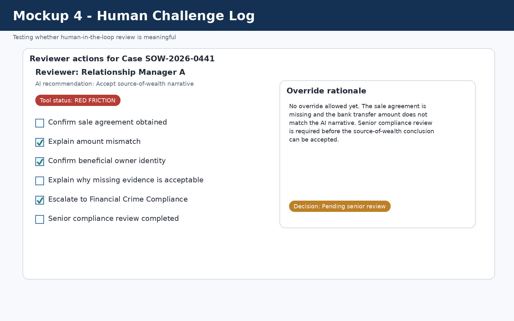
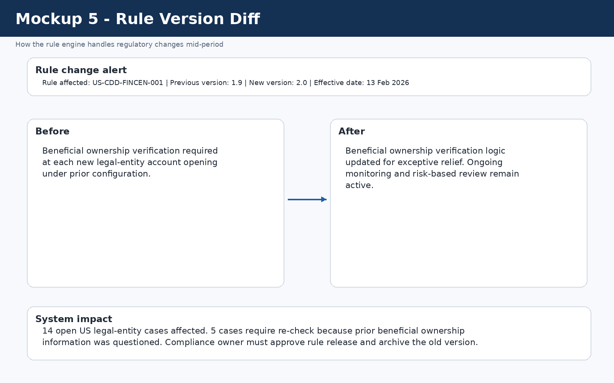

# Task3_Architecture_Design - Soteria SOW Guardian

**Option selected:** Option B - Architecture Design  
**Entity:** OCBC Bank Ltd  
**Jurisdictions:** Singapore and United States  
**Domain:** AI model risk management and AI governance for AML/KYC source-of-wealth due diligence  
**Tool name:** Soteria SOW Guardian - Jurisdiction-Aware AI Governance Monitor for KYC Source-of-Wealth Review

---

## 1. Executive summary

Soteria SOW Guardian is a jurisdiction-aware governance tool for banks using AI in KYC source-of-wealth review. The tool is designed around OCBC Bank Ltd and Bank of Singapore. It does not replace a bank's source-of-wealth drafting assistant. Instead, it sits around the AI-assisted workflow and monitors whether the AI-generated narrative is supported by evidence, whether human reviewers exercise judgment, whether model behaviour is drifting, and whether the correct Singapore or US rule logic is active.

The architecture is built around the values position from Task 2: AI may assist compliance work, but it should not convert uncertainty into false confidence. The main risk in this domain is that an AI-generated source-of-wealth report may look coherent and professional even when the underlying evidence is weak. A memo or spreadsheet can document that review occurred, but it cannot continuously test claim-to-document evidence, detect contradictions, monitor rule versions, or identify human rubber-stamping.

The tool's core outputs are **Green**, **Amber**, **Red Friction**, **Amber + Governance Gap**, and **Red Friction + Governance Gap**. Red Friction blocks straight-through approval and requires senior compliance review.

---

## 2. Why the use case is realistic

OCBC Bank Ltd is a Singapore-headquartered bank with US agencies in New York and Los Angeles. OCBC's USA page states that its New York Agency and Los Angeles Agency are branches of OCBC Bank, and that the New York Agency is supervised by the New York State Department of Financial Services and the Federal Reserve Bank of New York, while the Los Angeles Agency is supervised by the California Department of Financial Protection and Innovation and the Federal Reserve Bank of San Francisco [R1].

Bank of Singapore, OCBC's private banking arm, has publicly described a Source of Wealth Assistant that uses agentic AI to automate part of the KYC due diligence process. The bank states that the tool reduces source-of-wealth report preparation from around 10 days to one hour and that relationship managers review and refine the AI-generated drafts before internal AML/CFT review [R2].

This creates a strong RegTech design problem. The efficiency gain is valuable, but it also increases the need for governance because speed and narrative polish can be mistaken for evidentiary quality.

---

## 3. What the tool does and does not do

### 3.1 What the tool does

| Layer | Function |
|---|---|
| Evidence layer | Links each material AI-generated wealth claim to supporting documents. |
| AI governance layer | Tracks unsupported claims, hallucination risk, contradiction rate, drift, override patterns, and human challenge. |
| Jurisdiction layer | Applies Singapore or US rule logic based on booking location, touchpoints, AI system type, and case type. |
| Human judgment layer | Forces named human review for red-friction cases, jurisdictional conflicts, and weak evidence. |
| Audit layer | Produces a governance pack showing rule version, evidence status, reviewer actions, exceptions, and unresolved risks. |

### 3.2 What the tool does not do

| Boundary | Reason |
|---|---|
| It does not approve or reject customers automatically. | Source-of-wealth conclusions require human compliance judgment. |
| It does not file STRs or SARs automatically. | Suspicious transaction/activity reporting decisions require legal and compliance judgment. |
| It does not claim that a case is simply "MAS compliant" or "US compliant." | That would hide uncertainty and oversimplify regulatory judgment. |
| It does not perform full AML transaction monitoring. | Its scope is governance of AI-assisted KYC/source-of-wealth review. |
| It does not train general-purpose AI models on customer documents. | Source-of-wealth records are sensitive financial data. |
| It does not prove that wealth is legitimate. | It only assesses whether the bank's conclusion is supported by available evidence and proper governance. |

---

## 4. High-level architecture



### 4.1 System components

| Component | Function |
|---|---|
| Secure document vault | Stores source-of-wealth documents with role-based access, access logs, and retention rules. |
| Document extraction layer | Extracts names, dates, entities, amounts, assets, jurisdictions, and ownership references. |
| Evidence graph | Links AI-generated claims to supporting documents and marks missing or partial support. |
| Evidence sufficiency scorer | Calculates evidence coverage, unsupported claims, and contradiction metrics. |
| Jurisdiction rule engine | Selects Singapore, US, or dual-rule controls and records rule version/effective date. |
| Human challenge workflow | Records whether reviewers amend, reject, escalate, or override AI outputs. |
| Model monitoring module | Tracks drift, extraction errors, unsupported claims, post-review escalations, and reviewer correction rates. |
| Audit pack generator | Produces a case-level governance record for compliance, internal audit, and senior management. |

### 4.2 Data flow

```text
1. Relationship manager creates source-of-wealth case
2. Case metadata identifies booking location, customer type, and cross-border touchpoints
3. Customer documents are uploaded into the secure document vault
4. The bank's AI assistant drafts the source-of-wealth narrative
5. Soteria extracts material claims from the AI draft
6. Evidence graph links each claim to documents or marks it unsupported
7. Jurisdiction rule engine activates Singapore, US, or dual-rule controls
8. Evidence sufficiency and contradiction scores are calculated
9. Human review workflow assigns required reviewers and escalation level
10. Audit pack records rule version, evidence map, review actions, and unresolved risks
```

---

## 5. Synthetic data used in the design

The repository includes a synthetic dataset at `data/synthetic_sow_cases.csv`. It contains 30 simulated source-of-wealth governance cases. The dataset is included to show that the architecture has specific inputs and output logic rather than being only a conceptual diagram.

### 5.1 Dataset fields

| Field | Purpose |
|---|---|
| case_id | Synthetic case identifier. |
| jurisdiction | Singapore, United States, or Cross-border. |
| booking_location | Booking location or agency context. |
| sg_touchpoint / us_touchpoint | Flags whether Singapore or US controls may be relevant. |
| customer_type | Simulated customer category. |
| ai_system_type | Agentic AI, generative AI, non-generative AI, or traditional statistical model. |
| evidence_coverage_ratio | Supported material claims divided by total material claims. |
| unsupported_claim_rate | Unsupported AI material claims divided by total material AI claims. |
| contradiction_count | Number of material conflicts between the AI narrative and source documents. |
| human_challenge_rate | Indicator of whether reviewers are challenging AI outputs. |
| model_drift_flag | Whether model drift controls are triggered. |
| jurisdiction_conflict_flag | Whether dual-rule review is required. |
| privacy_exception_flag | Whether data-handling controls are triggered. |
| final_tool_output | Green, Amber, Red Friction, Amber + Governance Gap, or Red Friction + Governance Gap. |

### 5.2 Data limitation

The data is synthetic because real KYC/source-of-wealth files are confidential, sensitive, and unsuitable for a student assignment. The dataset is not calibrated against actual OCBC or Bank of Singapore customer outcomes.

---

## 6. Scoring methodology

### 6.1 Core formulas

```text
Evidence Coverage Ratio = supported material claims / total material claims

Unsupported Claim Rate = unsupported AI-generated material claims / total AI-generated material claims

Contradiction Count = number of material conflicts between AI narrative and source documents

Human Challenge Rate = cases where a human amended, rejected, or escalated AI output / total AI-assisted cases

Override Quality Score = percentage of overrides with case-specific reasons rather than generic approval text
```

### 6.2 Thresholds

| Condition | Output |
|---|---|
| Evidence coverage >= 85%, unsupported claim rate <= 10%, contradiction count = 0, no governance gap | Green |
| Evidence coverage 70-84%, unsupported claim rate 11-20%, contradiction count <= 1 | Amber |
| Evidence coverage < 70%, unsupported claim rate > 20%, or contradiction count >= 2 | Red Friction |
| US case + generative AI or agentic AI | Add Governance Gap Warning |
| Cross-border case with Singapore and US touchpoints | Activate Dual-Rule Review |
| Model drift flag = true | Red Friction and model-risk review |
| Human challenge rate below 20% | Human-overreliance warning |

A case cannot receive a Green output if material contradictions remain unresolved, even if all mandatory documentation fields are complete.

---

## 7. Decision points and owners

| Decision point | Question asked | Automated or human? | Owner | Output |
|---|---|---|---|---|
| DP1 Jurisdiction selection | Is this case Singapore, US, or cross-border? | Automated with human confirmation | Compliance Operations | Active rule set |
| DP2 AI system classification | Is the system traditional, non-generative AI, generative AI, or agentic AI? | Human-approved | Model Risk Manager | Model governance category |
| DP3 Evidence sufficiency | Are material source-of-wealth claims supported? | Automated scoring plus human review | Financial Crime Compliance | Green / Amber / Red Friction |
| DP4 Contradiction detection | Do source documents conflict with the AI narrative? | Automated flagging plus human judgment | Compliance Officer | Escalation if material |
| DP5 AML/KYC risk level | Is enhanced due diligence required? | Automated trigger plus compliance decision | Financial Crime Compliance | Standard review / EDD / escalation |
| DP6 Human challenge | Did the reviewer meaningfully challenge the AI output? | Automated monitoring plus audit review | Compliance Head / Internal Audit | Challenge quality score |
| DP7 Final source-of-wealth approval | Can the source-of-wealth conclusion be accepted? | Human only | Senior Compliance Officer | Approve / reject / request more evidence |
| DP8 Rule update approval | Should a new rule version be released? | Human only | Legal/Compliance rule owner | Updated rule version |
| DP9 Model drift response | Should use be paused or revalidated? | Human decision after system alert | Model Risk Committee | Revalidation / threshold change / freeze |
| DP10 STR/SAR decision | Is suspicious reporting required? | Human only | Financial Crime Compliance / Legal | File / no file / further review |

The design principle is that automation can organise evidence, but it cannot own judgment.

---

## 8. Jurisdiction rule engine

The jurisdiction rule engine is the mechanism that makes the tool genuinely jurisdiction-aware. It stores rules in a versioned repository with rule ID, jurisdiction, source, domain, trigger, control action, effective date, version, owner, and status.

### 8.1 Rule selection decision tree

```text
Start
|
|-- Is booking location Singapore or is there a Singapore touchpoint?
|      |-- Yes: Activate SG-AML-626 + SG-AI-MRM + SG-FEAT/Veritas
|      |-- No: Continue
|
|-- Is booking location United States or is a US agency/account involved?
|      |-- Yes: Activate US-CDD-FINCEN
|      |-- No: Continue
|
|-- What type of AI system is used?
|      |-- Traditional/statistical or non-generative AI + US: apply US-MRM-SR26-2
|      |-- Generative/agentic AI + Singapore: apply MAS AI governance controls
|      |-- Generative/agentic AI + US: issue US-AI-GAP governance warning
|
|-- Are both Singapore and US touchpoints present?
|      |-- Yes: Activate dual-rule review and no-silent-downgrade rule
|      |-- No: Continue single-jurisdiction review
|
|-- Calculate evidence and contradiction scores
|
|-- Apply Green / Amber / Red Friction output logic
```

### 8.2 Rule update and versioning process

| Step | Process |
|---|---|
| Source detection | Regulatory update detected from MAS, FinCEN, Federal Reserve, OCC, state regulator, or internal policy. |
| Legal/compliance review | Human owner confirms whether update applies to the relevant business line. |
| Rule drafting | Rule engineer converts the change into structured rule logic. |
| Dual approval | Compliance owner and technology owner approve the rule. |
| Version release | Rule is published with version number, effective date, expiry date if applicable, and owner. |
| Open-case impact analysis | System identifies open cases affected by the change. |
| Re-run or grandfathering decision | Compliance decides whether open cases must be reassessed. |
| Audit record | Old rule, new rule, approvers, affected cases, and decisions are logged. |

---

## 9. Jurisdiction-specific regulatory logic

### 9.1 Singapore mode

In Singapore mode, the tool treats AI-assisted source-of-wealth review as both an AML/KYC issue and an AI governance issue. MAS has published an AI Model Risk Management information paper based on a thematic review of banks' AI, including generative AI model risk management practices [R3]. MAS also has FEAT principles and the Veritas initiative for responsible AI and data analytics evaluation [R4, R5]. MAS Notice 626 sets AML/CFT requirements for banks, including risk assessment, risk mitigation, and customer due diligence [R6].

Singapore mode activates the following controls:

| Control area | Singapore-mode control |
|---|---|
| AI inventory | Record the AI system, owner, intended use, model type, and limits. |
| Human oversight | Require human review for all material source-of-wealth conclusions. |
| Evidence quality | Link every material wealth claim to supporting evidence or mark it unsupported. |
| FEAT/Veritas | Check accountability, transparency to internal users, fairness monitoring, and reviewer ownership. |
| AML/KYC | Apply customer due diligence, enhanced due diligence triggers, source-of-wealth evidence requirements, and ongoing monitoring logic. |
| Audit pack | Produce MAS-facing governance record showing rule version, evidence map, human review, and exceptions. |

### 9.2 US mode

In US mode, the tool applies US customer due diligence and model-risk logic. FinCEN's CDD materials describe customer due diligence obligations for covered financial institutions, including customer identification, beneficial ownership when required, customer risk profile, and ongoing monitoring [R7].

For model risk, the 2026 Federal Reserve and OCC materials distinguish traditional/non-generative model-risk governance from generative and agentic AI. The Federal Reserve guidance says generative AI and agentic AI are not within the scope of that guidance, while broader risk management and governance practices should guide controls for tools not covered by the guidance [R8]. OCC Bulletin 2026-13 states a similar exclusion for generative and agentic AI models [R9].

US mode activates the following controls:

| Control area | US-mode control |
|---|---|
| CDD | Customer identification, beneficial ownership when required, relationship purpose, risk profile, and ongoing monitoring. |
| Model risk | Apply SR 26-2-style controls only where the tool is a traditional/statistical or non-generative/non-agentic model. |
| AI governance gap | For generative or agentic AI, issue a governance gap warning rather than falsely marking the system as fully covered by SR 26-2. |
| Human approval | Require human compliance approval before accepting high-risk source-of-wealth conclusions. |
| Branch/agency context | Record whether the US touchpoint is New York Agency, Los Angeles Agency, or another US relationship. |
| Audit pack | Produce US-facing governance record showing CDD controls, AI governance gap, rule version, and human review. |

### 9.3 Same case, different jurisdictional output

| Same case fact | Singapore output | US output |
|---|---|---|
| Agentic AI used in KYC source-of-wealth workflow | MAS AI MRM, FEAT, and Veritas-style controls triggered. | Governance gap warning because generative/agentic AI is outside the specific 2026 model-risk guidance scope. |
| Source-of-wealth evidence incomplete | MAS Notice 626 CDD/EDD review triggered. | FinCEN CDD/customer risk profile review triggered. |
| Human reviewer approves without edits | Human accountability weakness flagged. | Effective challenge/internal governance weakness flagged. |
| Contradictions in sale proceeds | Red Friction and senior compliance review. | Red Friction + CDD escalation; add governance gap if AI is agentic/generative. |
| Singapore and US touchpoints both present | Dual-rule review and no-silent-downgrade rule. | Dual-rule review and no-silent-downgrade rule. |

This table is the core jurisdiction-aware design feature. The same operational facts produce different regulatory explanations depending on jurisdiction.

---

## 10. Mockups

### 10.1 Senior dashboard



### 10.2 Case-level jurisdiction output



### 10.3 Evidence graph



### 10.4 Human challenge log



### 10.5 Rule-version diff screen



---

## 11. Failure-mode analysis

| Failure mode | Cause | Impact | Likelihood | Severity | Control | Owner |
|---|---|---|---|---|---|---|
| Rule changes mid-period | Rule engine not updated or open cases not re-run | Cases assessed under obsolete requirements | Medium | High | Versioned rules, effective dates, rule-diff alert, open-case impact analysis | Compliance rule owner |
| Model drift | AI behaviour, typologies, or document formats change | More hallucinated or unsupported source-of-wealth claims | Medium | High | Drift thresholds, unsupported-claim monitoring, model-risk review | Model Risk Manager |
| Human rubber-stamping | Reviewers approve AI drafts without challenge | Human-in-the-loop becomes symbolic | High | High | Human Challenge Log and reviewer-pattern monitoring | Financial Crime Compliance Head |
| Jurisdictional misconfiguration | Wrong booking location or cross-border flag selected | Wrong rule set applied | Medium | High | Booking-location check, branch/agency check, dual-rule activation | Compliance Operations |
| Contradictory jurisdictional requirements | US and Singapore controls point in different directions | Confusion over whether stricter or lighter controls apply | Medium | High | No-silent-downgrade rule and additive controls | AI Governance Committee |
| Privacy/data-security failure | Sensitive documents processed or retained improperly | Customer privacy harm and regulatory exposure | Low/Medium | Very High | Secure vault, role-based access, access logs, retention controls | Technology Risk / DPO |
| False negative | Illicit or unsupported wealth accepted as legitimate | Financial crime risk enters the banking system | Medium | Very High | Red Friction, senior compliance approval, contradiction detection | Financial Crime Compliance |
| False positive | Legitimate customer incorrectly flagged | Delayed onboarding and relationship harm | Medium | Medium | Explainable escalation reason and proportional follow-up | Relationship Manager + Compliance Officer |
| Threshold miscalibration | Thresholds tuned for efficiency rather than risk | Too many weak cases pass or too many good cases escalate | Medium | High | Periodic threshold review, sensitivity testing, outcome monitoring | Model Risk Manager |
| Vendor interface design failure | Dashboard hides uncertainty or over-emphasizes green status | Users gain false confidence | Medium | High | No simple compliance badge, uncertainty labels, audit logs | Soteria Product Owner |

### 11.1 What happens when a rule changes mid-period?

The rule engine stores effective dates and version numbers. When a rule changes, the tool creates a rule-diff alert, identifies affected open cases, and requires a compliance owner to decide whether cases should be re-run or grandfathered. The old and new rules are both retained for audit.

### 11.2 What happens when a model drifts?

The tool monitors unsupported claim rate, contradiction count, reviewer correction rate, post-review escalation rate, and extraction error rate. If drift crosses threshold, the tool freezes straight-through approval, requires enhanced human review, notifies model risk management, and produces a drift incident report.

### 11.3 What happens when jurisdictions contradict each other?

The tool applies a no-silent-downgrade rule. If one jurisdiction creates a governance gap and another jurisdiction requires active governance, the tool does not treat the gap as permission to reduce controls. Cross-border cases receive additive controls until a human legal/compliance owner approves a jurisdictional interpretation.

---

## 12. Privacy and data-governance architecture

Source-of-wealth review involves highly sensitive financial and personal data, including tax records, bank statements, payslips, corporate filings, beneficial ownership details, investment records, and property documents. Privacy is therefore a core design requirement.

| Control | Description |
|---|---|
| Secure document vault | Raw documents are stored in a controlled bank environment. |
| Role-based access | Access is limited to authorized relationship managers, compliance reviewers, audit, and model-risk users. |
| Access logs | All document access and evidence-map changes are logged. |
| No uncontrolled model training | Customer documents are not used to train general-purpose models. |
| Retention controls | Raw documents are retained only under approved policies. |
| Cross-border transfer flag | Cases involving US and Singapore touchpoints are flagged for data-transfer review. |
| Separation of pipelines | Evidence extraction is separated from any model-improvement process. |

---

## 13. Implementation-lite decision logic

A simplified version of the rule logic is included in `rule_engine/pseudocode_decision_logic.md`. The following simplified logic shows the core approach:

```python
if singapore_touchpoint:
    activate(["SG-AML-626", "SG-AI-MRM", "SG-FEAT"])

if us_touchpoint:
    activate(["US-CDD-FINCEN"])

if ai_system_type in ["generative_ai", "agentic_ai"] and us_touchpoint:
    activate(["US-AI-GAP"])
    warn("Do not mark as fully covered by SR 26-2")

if evidence_coverage_ratio < 0.70 or unsupported_claim_rate > 0.20 or contradiction_count >= 2:
    output = "RED_FRICTION"
elif "US-AI-GAP" in active_rules:
    output = "AMBER_WITH_GOVERNANCE_GAP"
else:
    output = "GREEN_OR_AMBER_BASED_ON_EVIDENCE_SCORE"
```

---

## 14. What I did not build because of time and data limits

1. I did not calibrate thresholds using real OCBC or Bank of Singapore customer files.
2. I did not validate model drift against production AI outputs.
3. I did not test the tool against real suspicious transaction or suspicious activity reporting outcomes.
4. I did not build a live integration with OCBC systems, MAS systems, FinCEN systems, or screening vendors.
5. I did not provide legal advice on MAS, FinCEN, Federal Reserve, OCC, or state regulator obligations.
6. I used synthetic data because real KYC/source-of-wealth data is confidential and sensitive.
7. I did not build a full AML transaction monitoring system; this tool is limited to governance of AI-assisted source-of-wealth review.

These limitations are important. The tool is a defensible architecture and mockup, not a production compliance system.

---

## 15. Why a memo or spreadsheet cannot solve this problem

| Problem | Memo/spreadsheet limitation | Tool advantage |
|---|---|---|
| Unsupported AI claims | Manual reviewer may miss unsupported narrative claims. | Tool links every material claim to documents and flags missing evidence. |
| Contradictions | Hard to compare many documents manually. | Tool compares dates, amounts, names, entities, and jurisdictions. |
| Jurisdiction rules | Spreadsheet rules become outdated. | Rule engine stores versions, effective dates, and owners. |
| Model drift | Hard to detect over time. | Tool monitors unsupported claims, contradictions, and review outcomes. |
| Human rubber-stamping | Memo records approval, not quality of challenge. | Human Challenge Log tracks edits, overrides, and escalation behaviour. |
| Audit readiness | Evidence is fragmented. | Audit pack records rule version, evidence map, reviewer actions, and exceptions. |

---

## 16. Final design position

My final design position is that AI can assist source-of-wealth review, but it should not be allowed to convert uncertainty into false confidence. The tool therefore has four commitments:

1. **Evidence first:** every material AI claim should be linked to support or marked unsupported.
2. **Human accountability:** final source-of-wealth judgment must remain with identifiable human reviewers.
3. **Jurisdictional honesty:** Singapore and US controls must be applied differently where the regulatory logic differs.
4. **No cosmetic compliance:** the tool should not issue a simple "compliant" badge when evidence gaps, model drift, privacy issues, or governance gaps remain unresolved.

---

## References

[R1] OCBC Bank Ltd, USA international presence page. https://www.ocbc.com/business-banking/international/usa

[R2] Bank of Singapore, "Bank of Singapore deploys agentic AI tool to automate writing of source of wealth reports," 10 October 2025. https://www.bankofsingapore.com/media-releases/2025/bank-of-singapore-deploys-agentic-ai-tool-to-automate-writing-of-source-of-wealth-reports.html

[R3] Monetary Authority of Singapore, "Artificial Intelligence (AI) Model Risk Management," 5 December 2024. https://www.mas.gov.sg/publications/monographs-or-information-paper/2024/artificial-intelligence-model-risk-management

[R4] Monetary Authority of Singapore, "Principles to Promote Fairness, Ethics, Accountability and Transparency (FEAT) in the Use of Artificial Intelligence and Data Analytics in Singapore's Financial Sector," 2018. https://www.mas.gov.sg/publications/monographs-or-information-paper/2018/feat

[R5] Monetary Authority of Singapore, "Veritas." https://www.mas.gov.sg/schemes-and-initiatives/veritas

[R6] Monetary Authority of Singapore, "Notice 626 Prevention of Money Laundering and Countering the Financing of Terrorism - Banks." https://www.mas.gov.sg/regulation/notices/notice-626

[R7] Financial Crimes Enforcement Network, "CDD Final Rule." https://www.fincen.gov/resources/statutes-and-regulations/cdd-final-rule

[R8] Board of Governors of the Federal Reserve System, "SR 26-2 / Revised Guidance on Model Risk Management," 17 April 2026. https://www.federalreserve.gov/supervisionreg/srletters/SR2602.htm

[R9] Office of the Comptroller of the Currency, "Model Risk Management: Revised Guidance," OCC Bulletin 2026-13, 17 April 2026. https://www.occ.treas.gov/news-issuances/bulletins/2026/bulletin-2026-13.html

[R10] FinCEN, "FinCEN Issues Exceptive Relief to Streamline Customer Due Diligence Requirements," 13 February 2026. https://www.fincen.gov/news/news-releases/fincen-issues-exceptive-relief-streamline-customer-due-diligence-requirements
